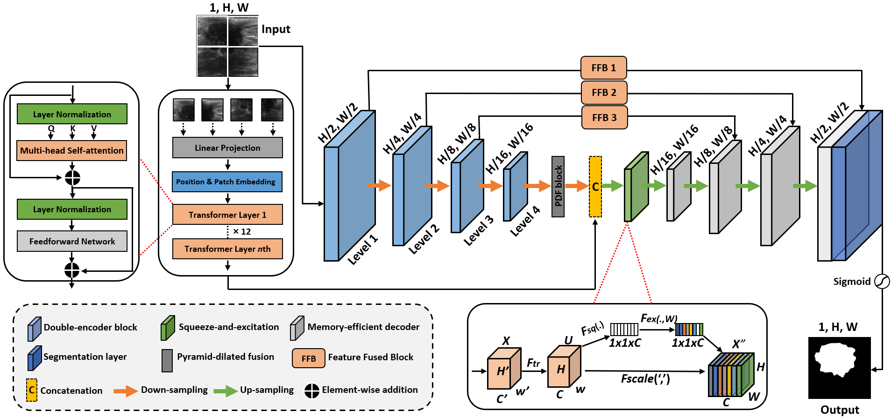

This repository contains the original PyTorch implementation of the paper "**[Memory-efficient transformer network with feature fusion for breast tumor segmentation and classification task](https://doi.org/10.1016/j.engappai.2023.107292)**", which was published in the journal "Engineering Applications of Artificial Intelligence - Elsevier" with an impact factor of 8.0.

## Proposed Architecture


# Feature Fusion Block


## Challenging Visual Results


## Requirements
- GPU: NVIDIA GeForce RTX 2060 SUPER
- Python 3.9.7
- PyTorch: 2.0.0
- OpenCV: 4.6.0
- Numpy: 1.22.3
- Matplotlib: 3.5.1

## Cite:

Please cite the following paper if you use the MET-Net architecture in your project:
```
Iqbal, A., & Sharif, M. (2023). Memory-efficient transformer network with feature fusion for breast tumor segmentation and classification task
. Engineering Applications of Artificial Intelligence, Volume 127, Part B, January 2024, 107292. DOI: https://doi.org/10.1016/j.eswa.2023.119718
